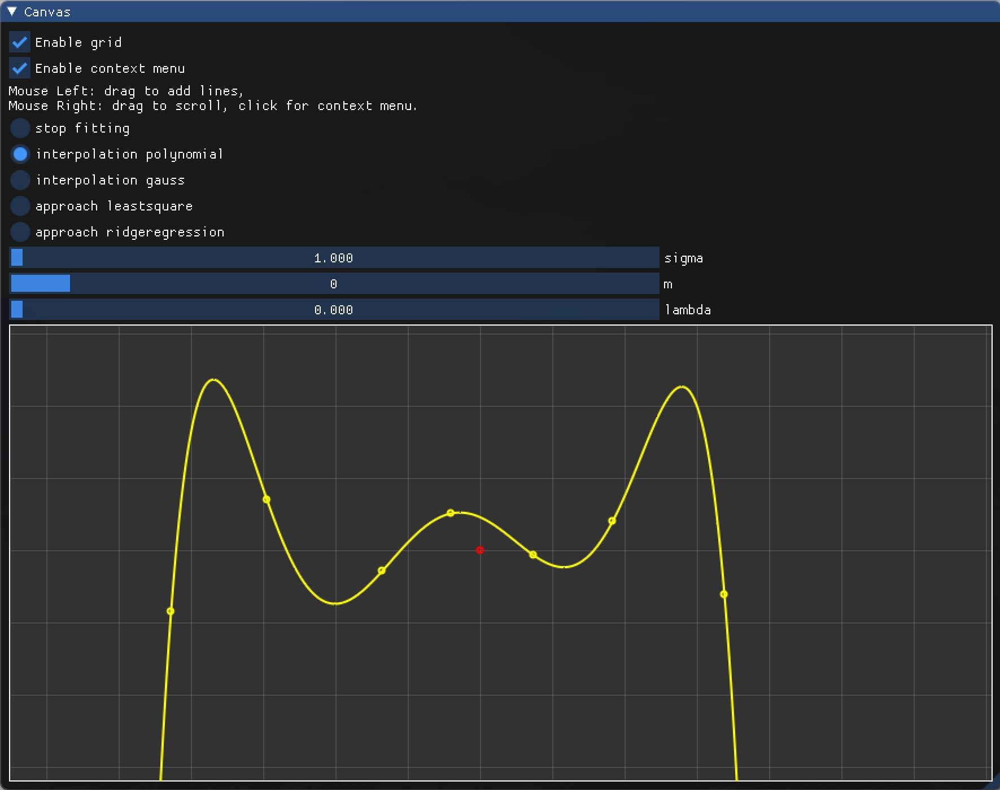
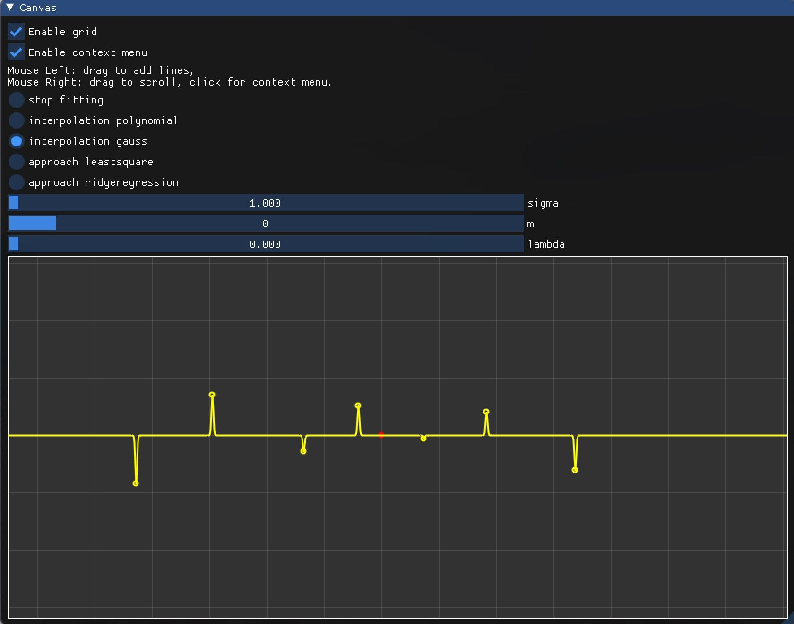
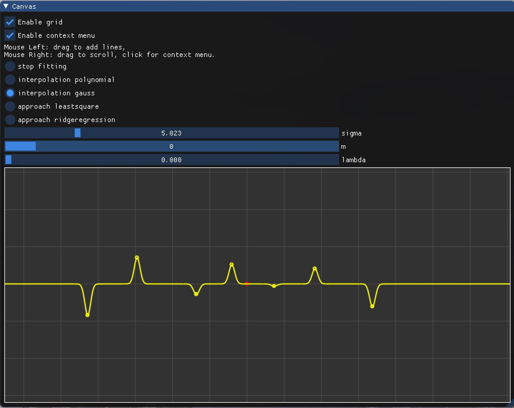
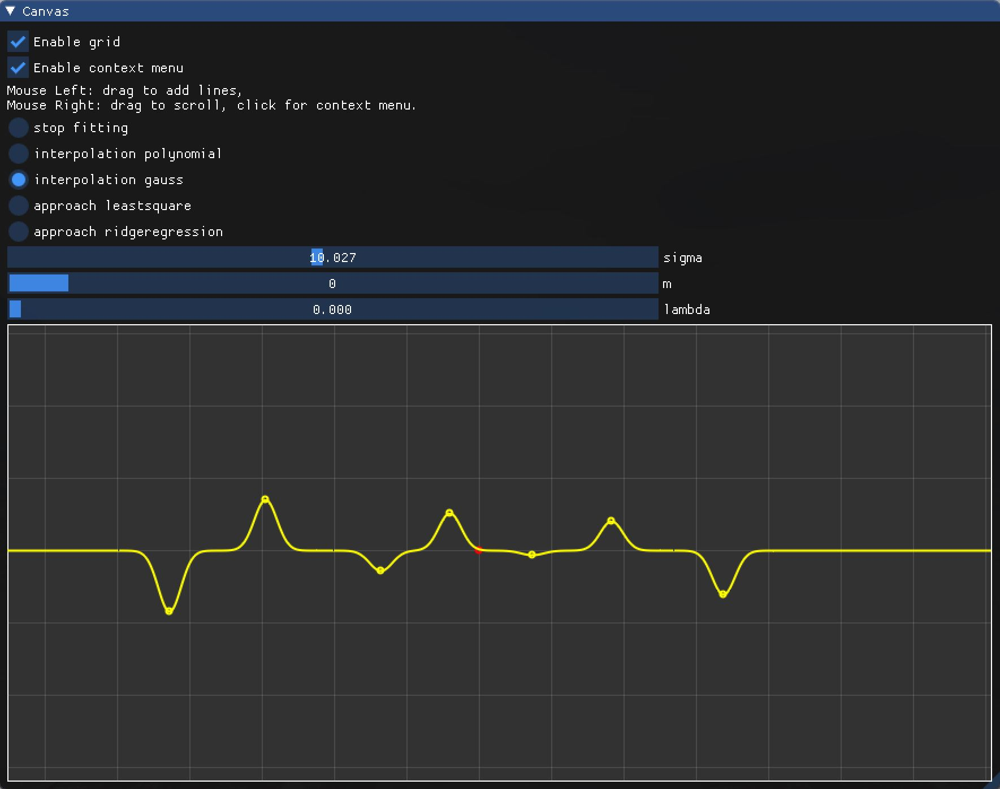
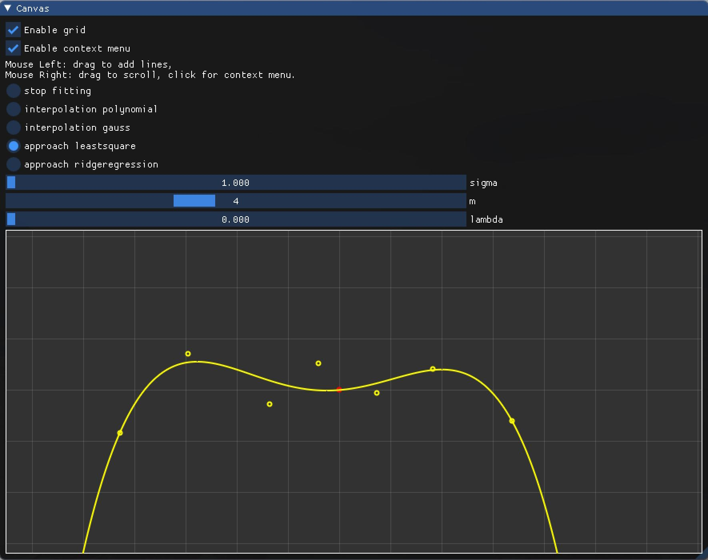
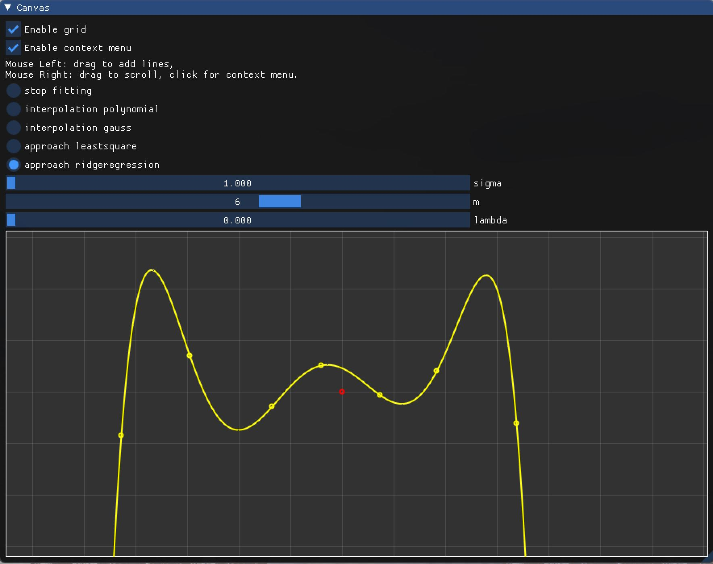
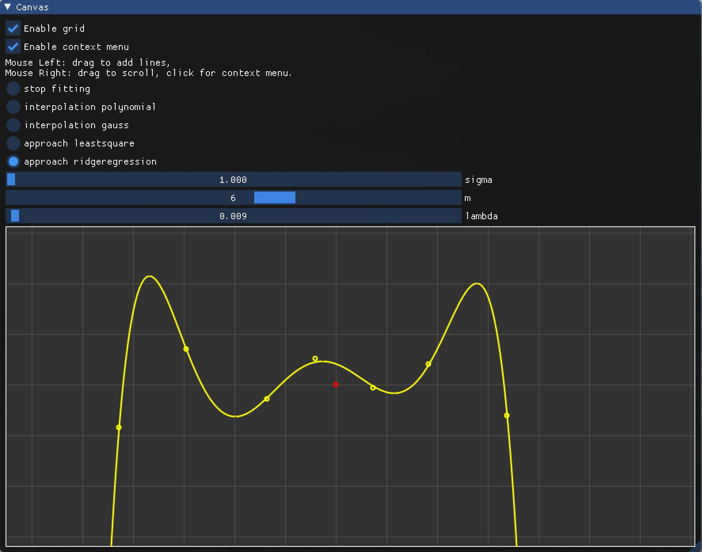
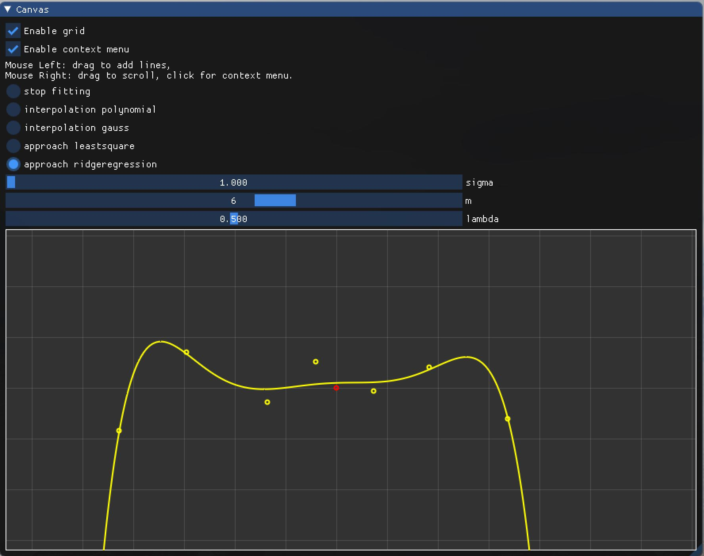
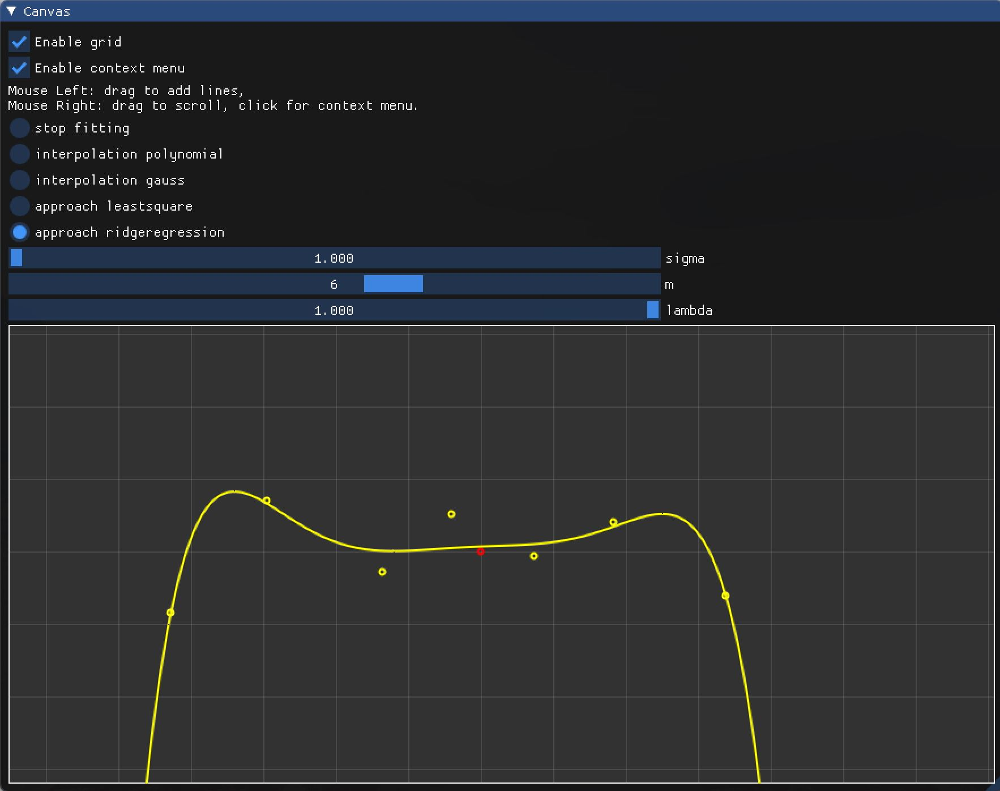

# 作业 1  

## 一、插值型拟合方法  

1. 使用多项式函数（幂基函数的线性组合）  

- 输入点集（点的数量 $n=7$）  
- 选择拟合方法为 `interpolation polynomial`  

2. 使用 Gauss 基函数的线性组合  

- 输入点集（点的数量 $n=7$）  
- 选择拟合方法为 `interpolation gauss`  
- 输入参数 $\sigma = 1$  

- 修改参数 $\sigma \approx 5$  

- 修改参数 $\sigma \approx 10$  

- 修改参数 $\sigma=20$  

## 二、逼近型拟合方法  

1. 最小二乘法  

- 输入点集（点的数量 $n=7$）  
- 选择拟合方法为 `approach leastsquare`  
- 输入幂基函数的最高次数 $m=4$  

2. 岭回归  

- 输入点集（点的数量 $n=7$）  
- 选择拟合方法为 `approach ridgeregression`  
- 输入幂基函数的最高次数 $m=6$  
- 输入参数 $\lambda = 0$  

- 修改参数 $\lambda \approx 0.1$  

- 修改参数 $\lambda=0.5$  

- 修改参数 $\lambda=1$  

