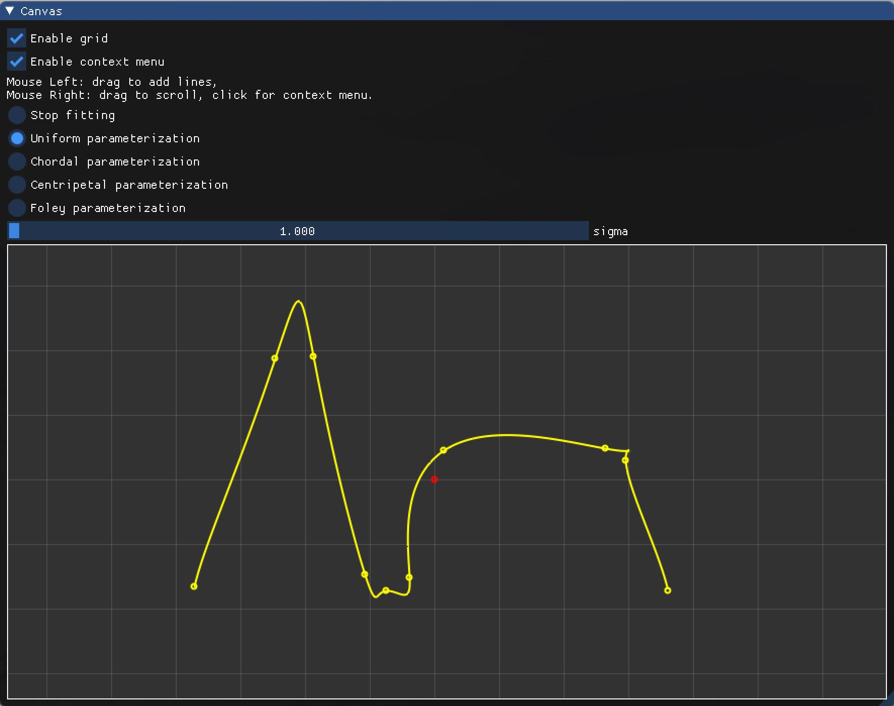
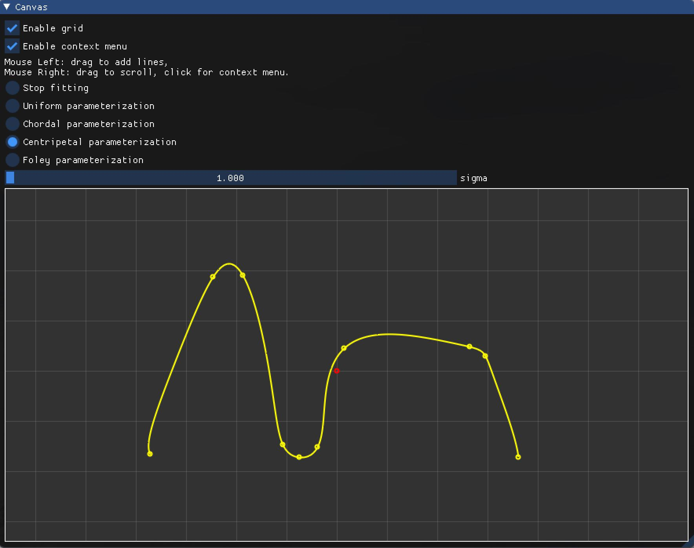
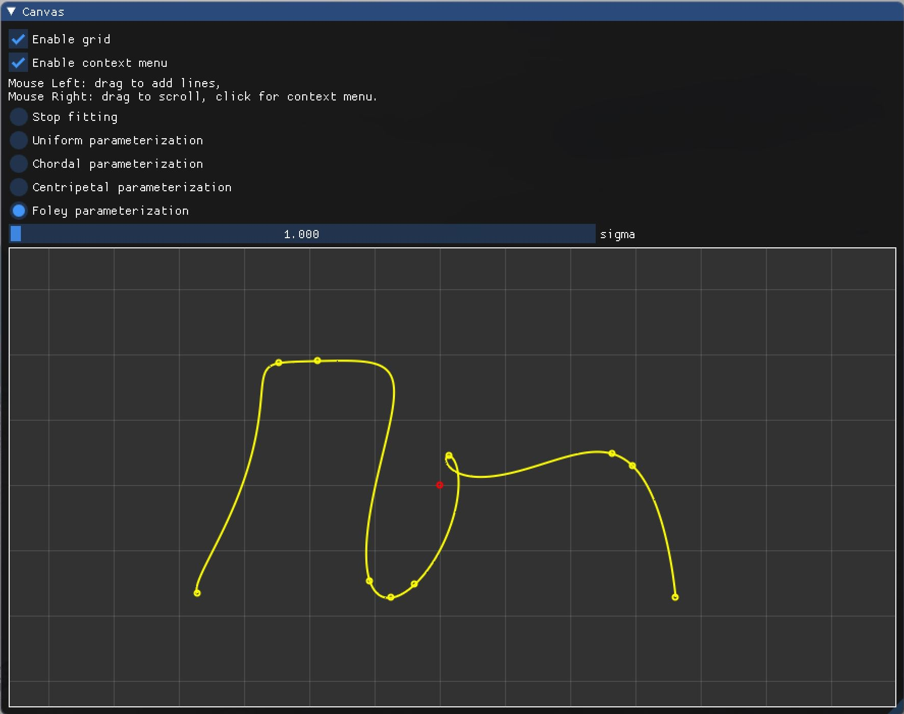

# 作业 3（参数曲线拟合）  

**1. Uniform parameterization**  

- 输入点集  
- 选择参数化方法为 `Uniform parameterization`  
- 选择高斯基函数的参数 $sigma=1$  

**2. Chordal parameterization**  

- 输入点集  
- 选择参数化方法为 `Chordal parameterization`  
- 选择高斯基函数的参数 $\sigma=1$  

**3. Centripetal parameterization**  

- 输入点集  
- 选择参数化方法为 `Centripetal parameterization`  
- 选择高斯基函数的参数 $\sigma=1$  

**4. Foley parameterization**  

- 输入点集  
- 选择参数化方法为 `Foley parameterization`  
- 选择高斯基函数的参数 $\sigma=1$  

