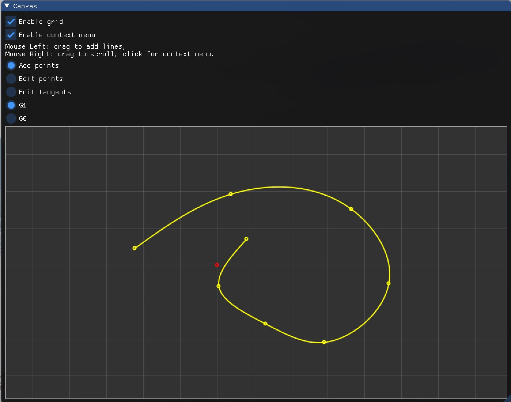
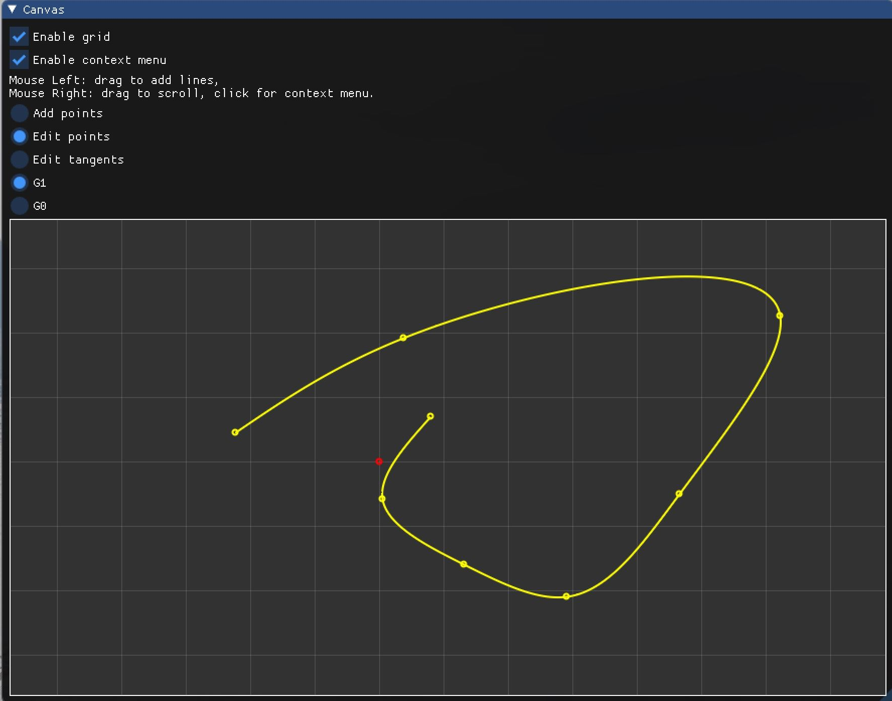
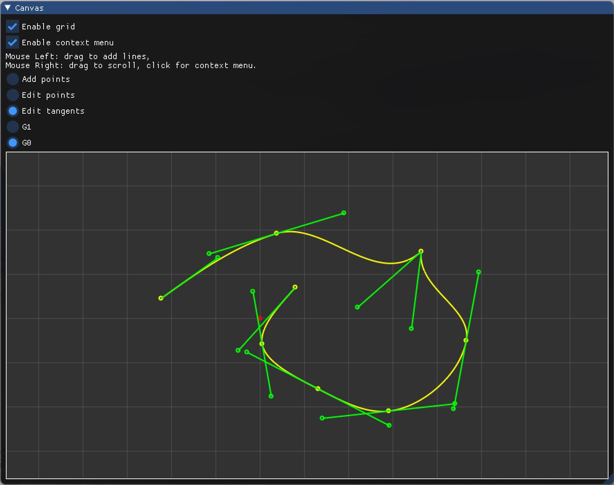

# 作业 4（三次样条函数）  

**输入有序点列（型值点），实时生成分段的三次样条曲线**  

- 选择交互方式为 `Add points`  
- 鼠标左键单击，输入型值点位置  

**可修改拖动型值点的位置（保持整条曲线 $C^2$）**  

- 选择交互方式为 `Edit points`  
- 鼠标左键选中型值点并拖动，修改型值点位置（以右上角型值点为例）  

**可编辑型值点处的切线信息，成为 $G^1$ 或 $G^0$**  

- 选择交互方式为 `Edit tangents`  
- 选择曲线连续性为 `G1`  
- 鼠标左键选中切线端点并拖动，编辑切线信息（以右上角型值点为例）  

- 选择曲线连续性为 `G0`  
- 鼠标左键选中切线端点并拖动，编辑切线信息（以右上角型值点为例）  

