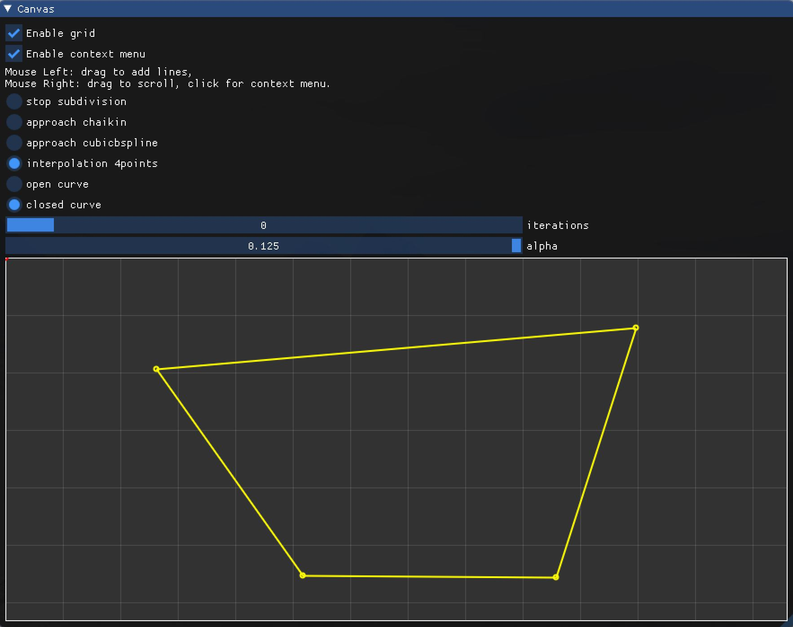
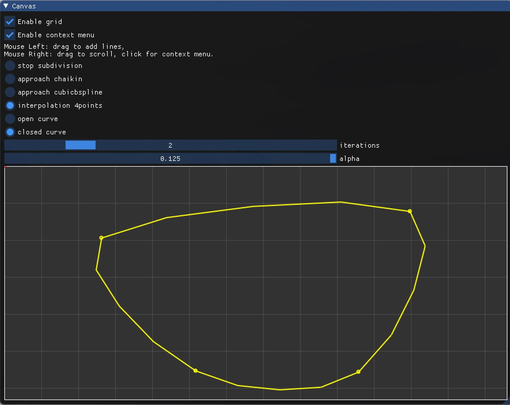

# 作业 5（曲线细分）  

## 一、逼近型细分  

Chaikin 方法（二次 B 样条）  

- 输入点集  
- 选择细分方法 `approach chaikin`  
- 选择闭合曲线 `closed curve`  
- 迭代次数 $iterations=0$  

- 迭代次数 $iterations=1$  

- 迭代次数 $iterations=2$  

- 迭代次数 $iterations=3$  

三次 B 样条细分方法  

- 输入点集  
- 选择细分方法 `approach cubicbspline`  
- 选择闭合曲线 `closed curve`  
- 迭代次数 $iterations=0$  

- 迭代次数 $iterations=1$  

- 迭代次数 $iterations=2$  

- 迭代次数 $iterations=3$  

## 二、插值型细分  

4 点细分方法  

- 输入点集  
- 选择细分方法 `interpolation 4points`  
- 选择闭合曲线 `closed curve`  
- 输入参数 $\alpha=0.125$  
- 迭代次数 $iterations=0$  

- 迭代次数 $iterations=1$  

- 迭代次数 $iterations=2$  

- 迭代次数 $iterations=3$  

