# 作业 6（极小曲面局部方法）  

**输入网格**  

- 在 `Hierarchy` 中右键空白处，选择 `Create Empty Entity`  
- 在 `Inspector` 中点击 `Attach Component`，选择 `struct Ubpa::Utopia::LocalToWorld`、`struct Ubpa::Utopia::MeshFilter` 和 `struct Ubpa::Utopia::MeshRenderer`  
- 将 `Project&Folder` 中的 `assets/models/Balls` 拖入 `mesh`，`assets/materials/wireframe` 拖入 `materials`  
- 在 `Hierarchy` 中点击 `Denoise Data`，将 `assets/models/Balls` 拖入 `mesh`  
- 可将 `Balls` 替换为其它网格，如 `David328` 和 `Nefertiti_face`  

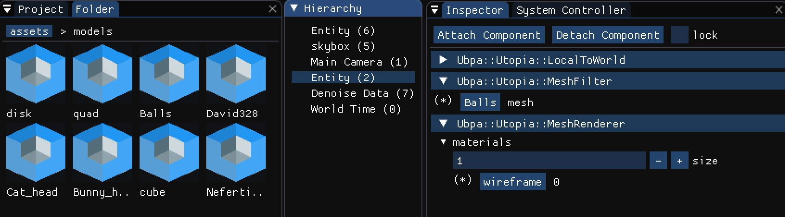

`Balls`：  

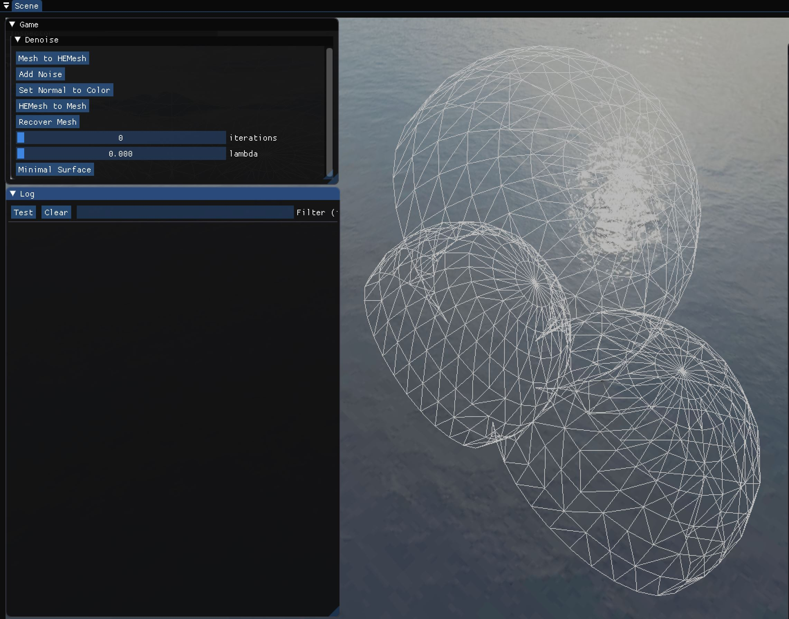

`David328`：  

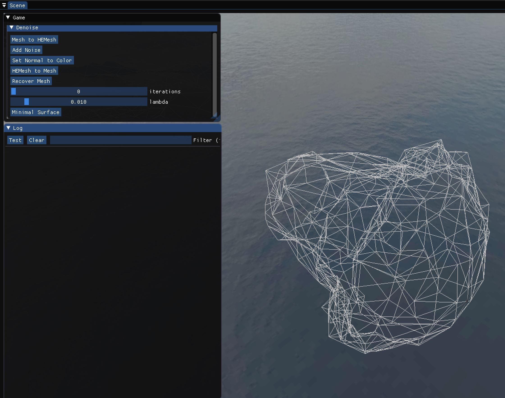

`Nefertiti_face`：  

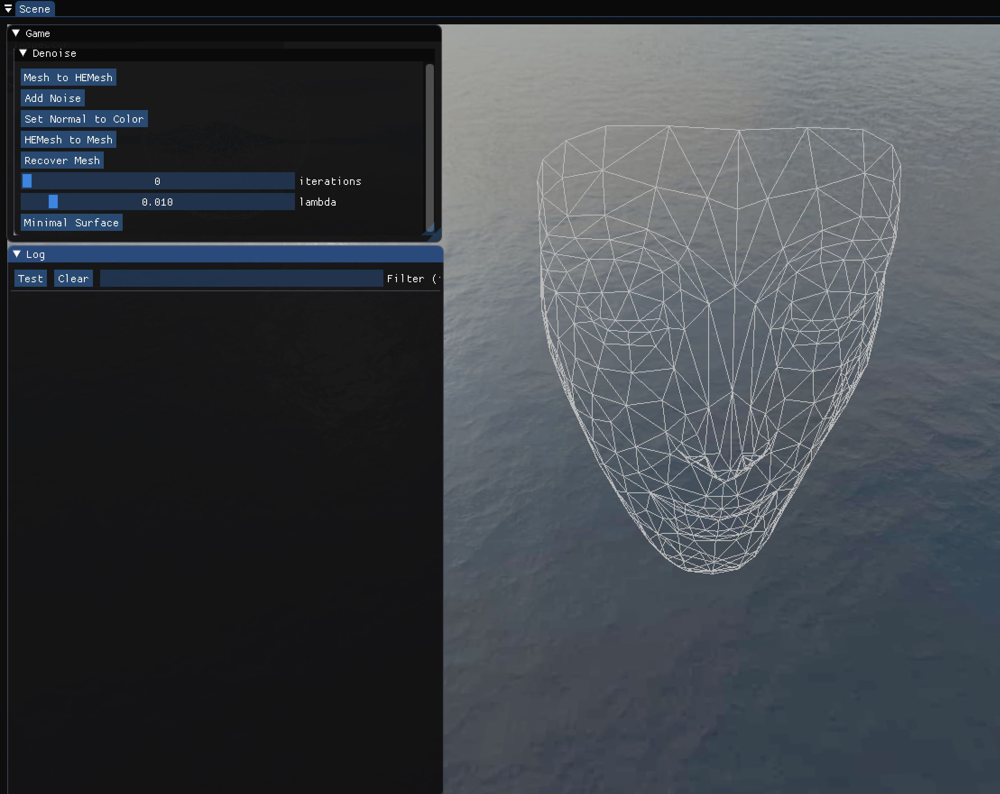

**实现极小曲面的局部法**  

- 点击 `Mesh to HEMesh`  
- 输入迭代次数 $iterations$  
- 输入参数 $\lambda=0.01$  
- 点击 `Minimal Surface`  
- 点击 `HEMesh to Mesh`  

`Balls`：  

$iterations=250$  

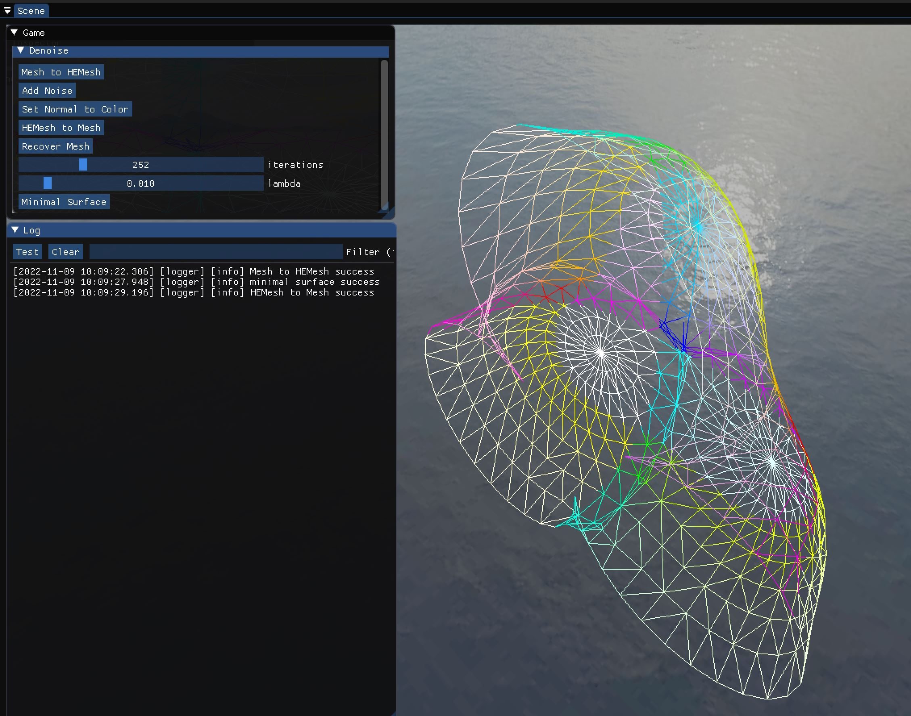

$iterations=500$  

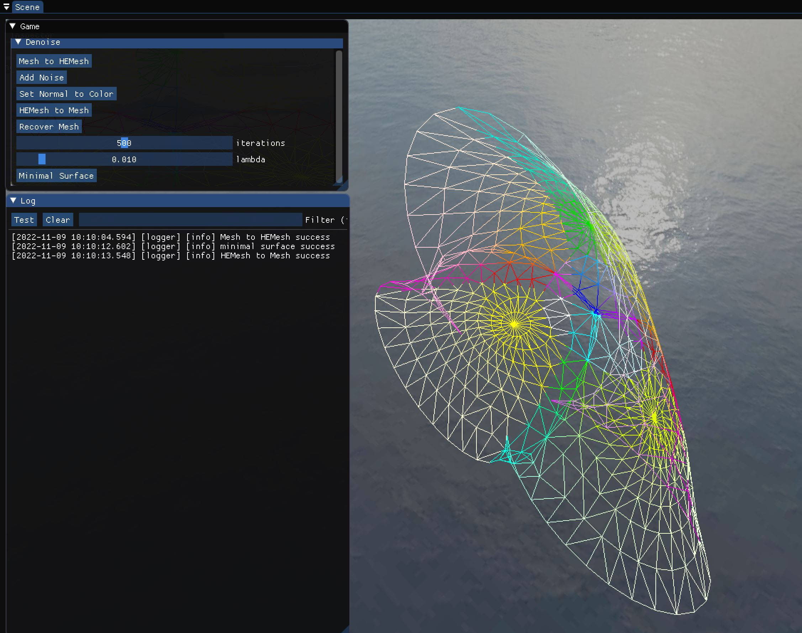

$iterations=750$  

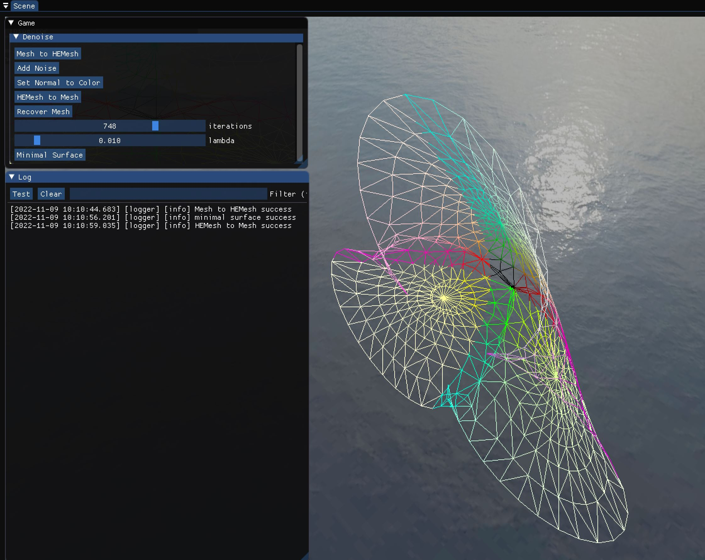

$iterations=1000$  

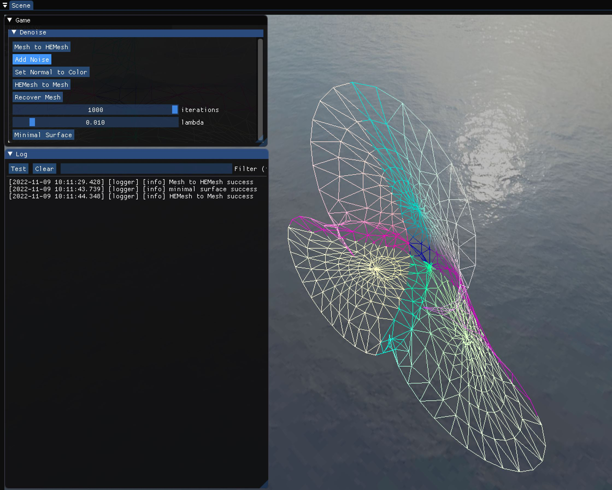

`David328`：  

$iterations=250$  

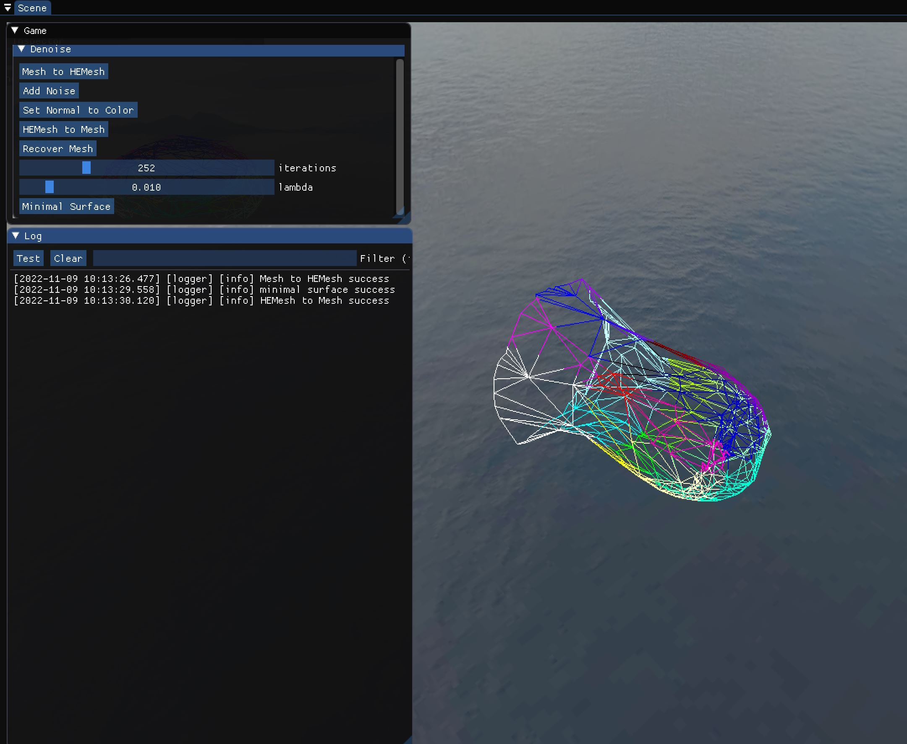

$iterations=500$  

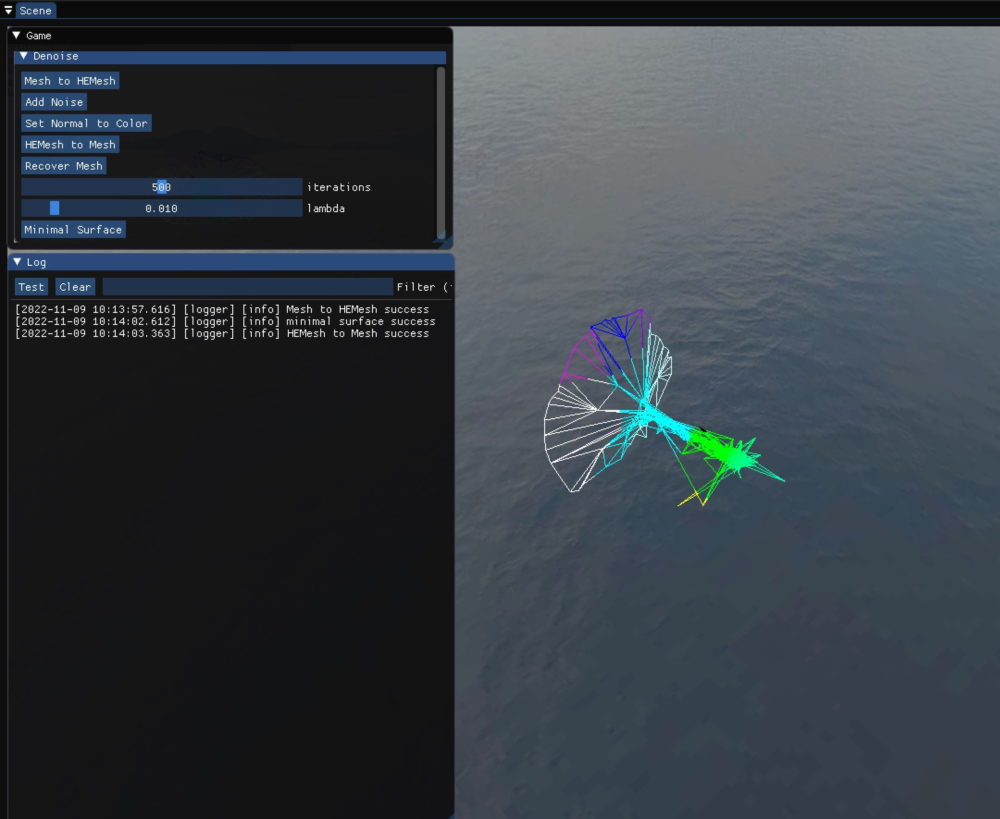

$iterations=750$  

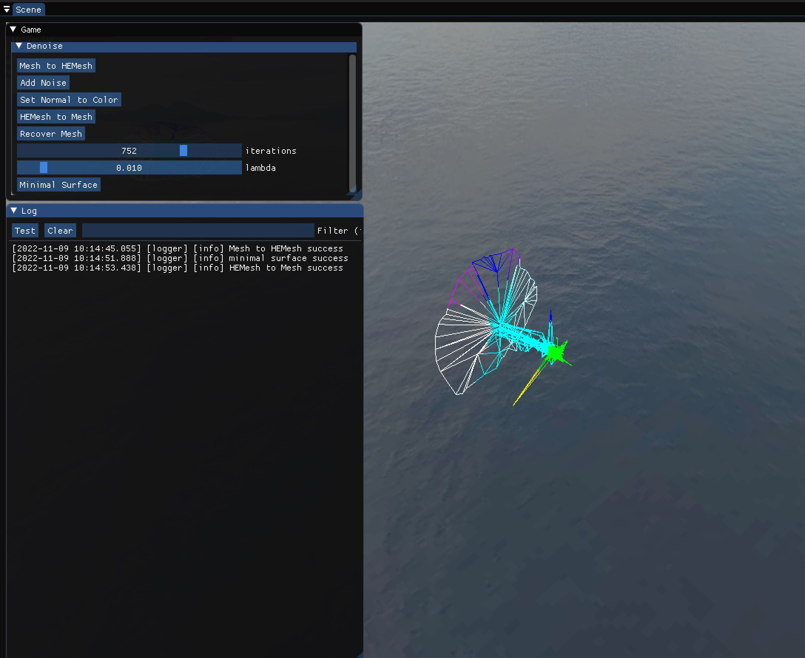

$iterations=1000$  

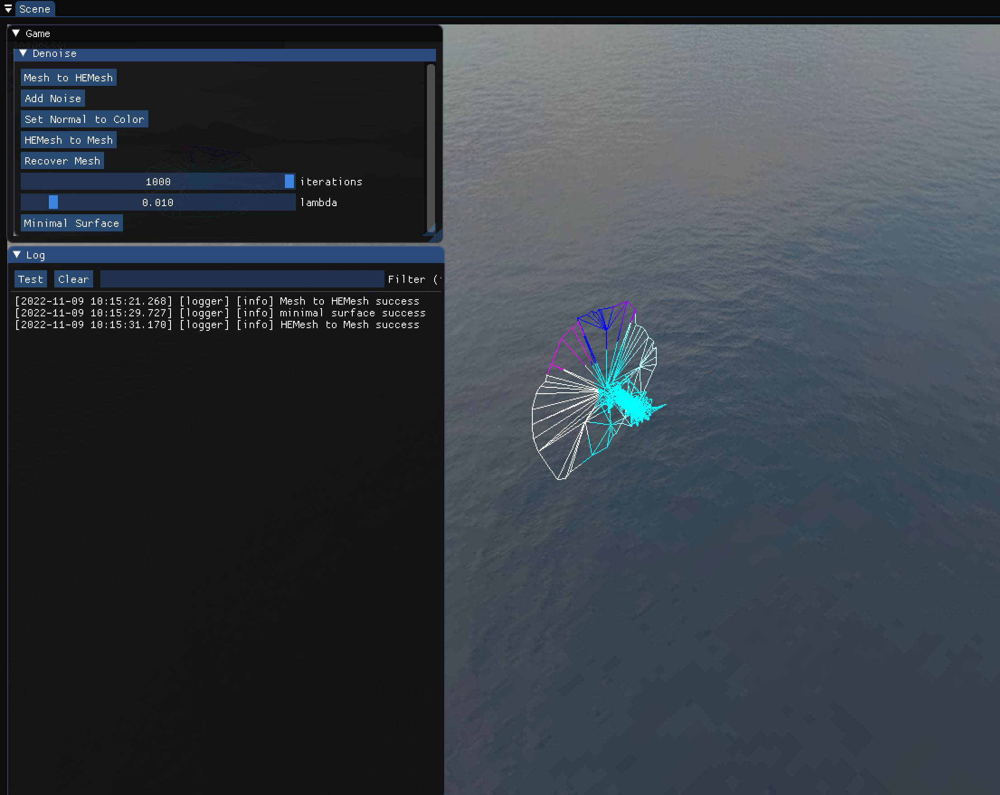

`Nefertiti_face`：  

$iterations=250$  

$iterations=500$  

$iterations=750$  

$iterations=1000$  

