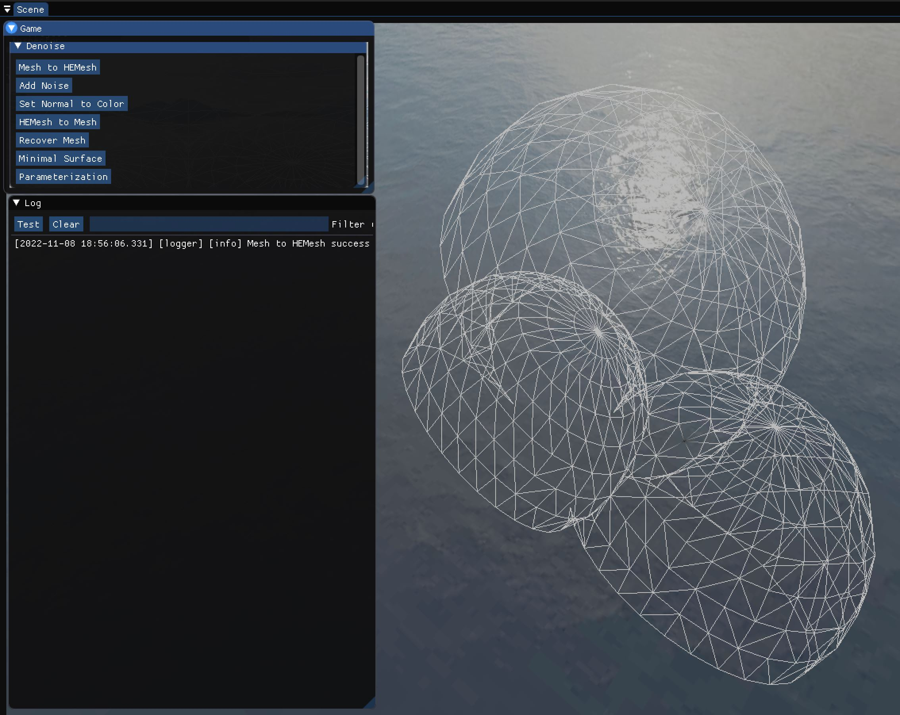
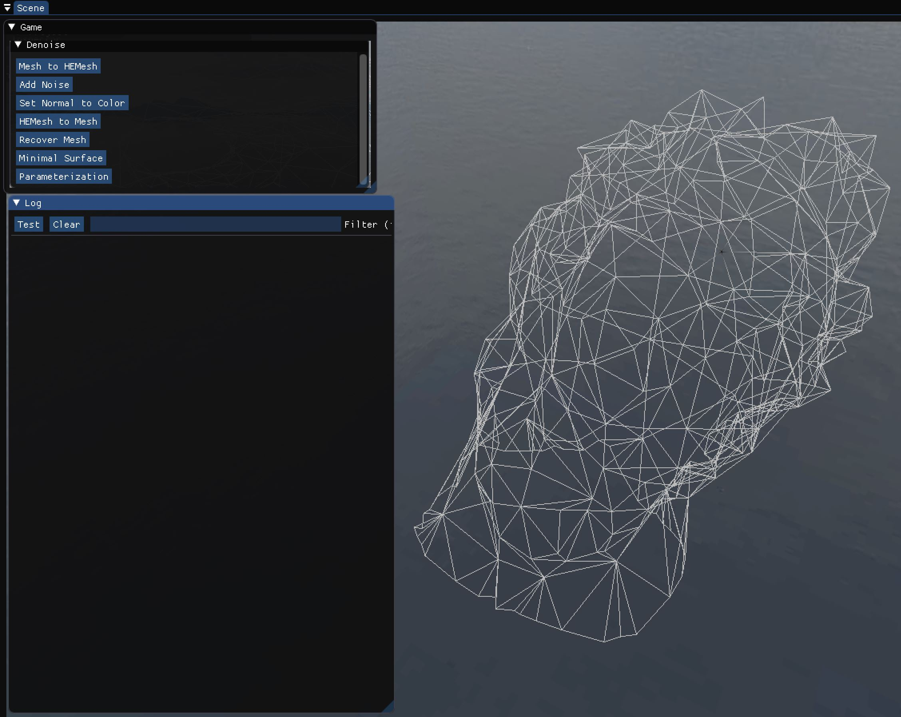
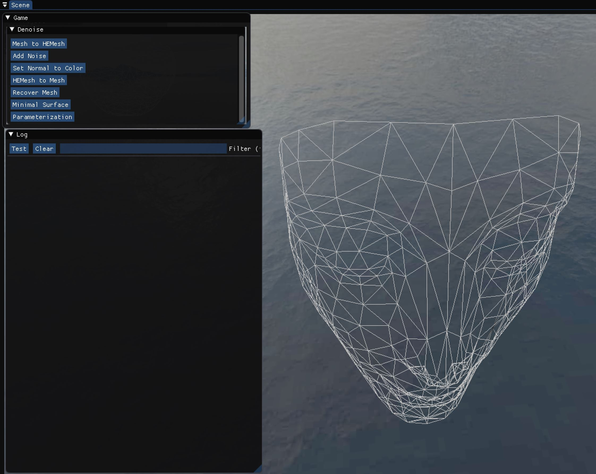
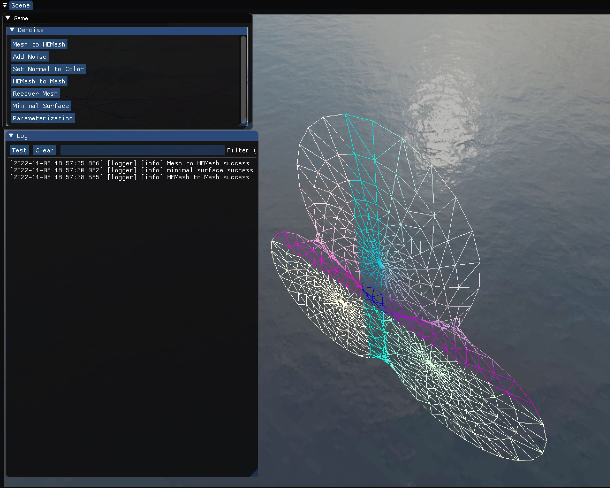
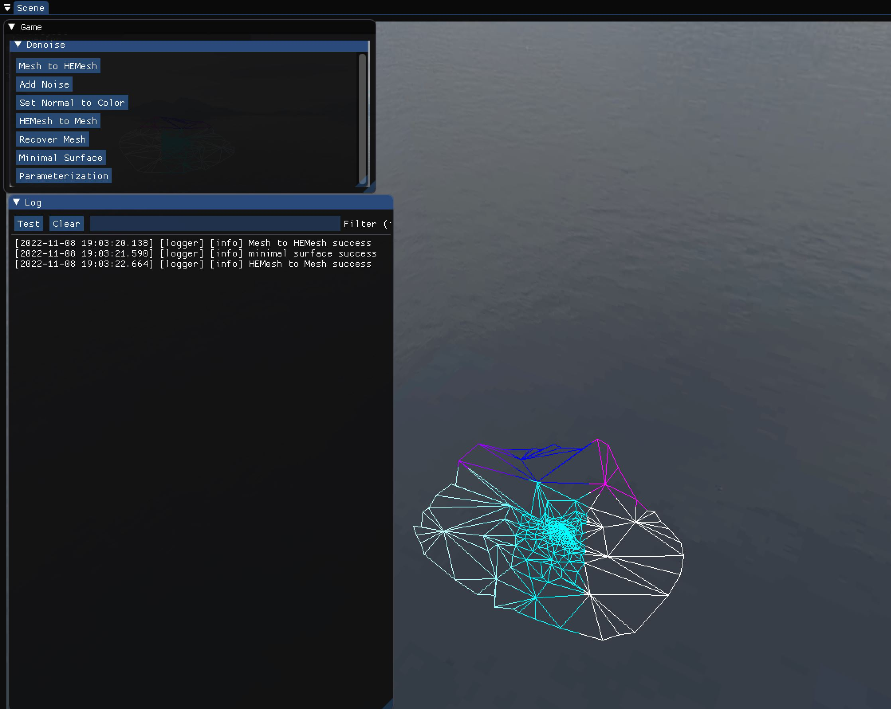
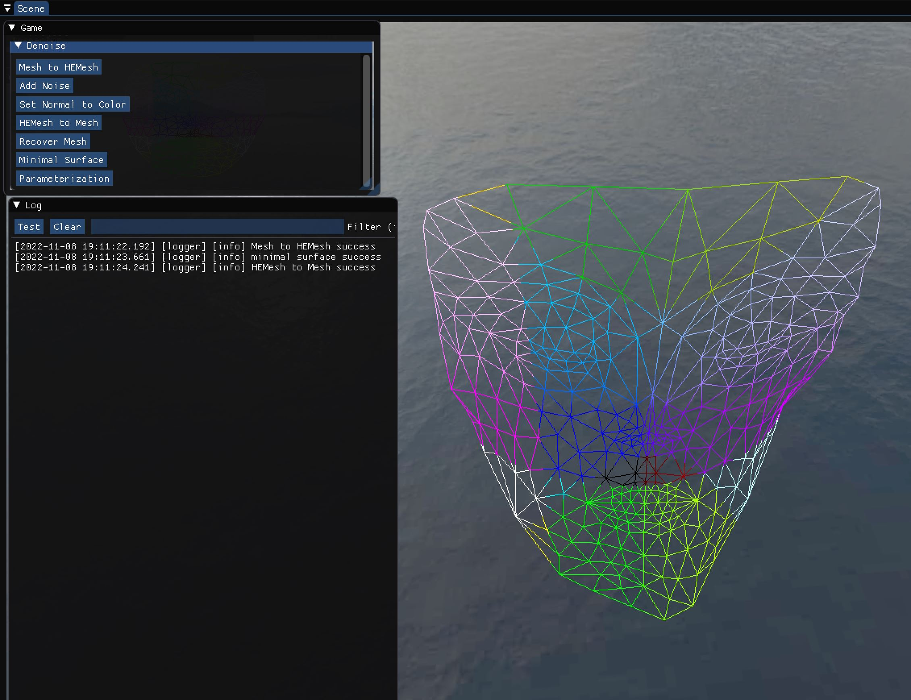
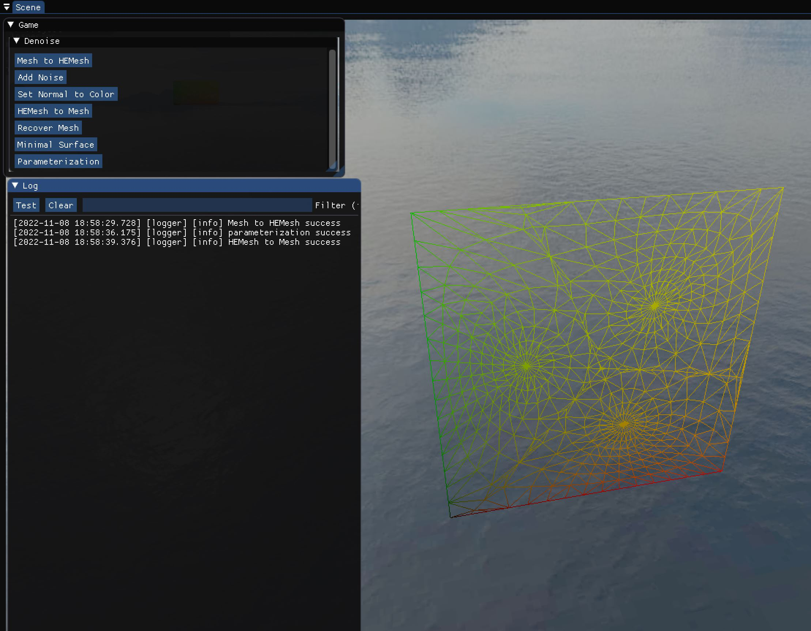
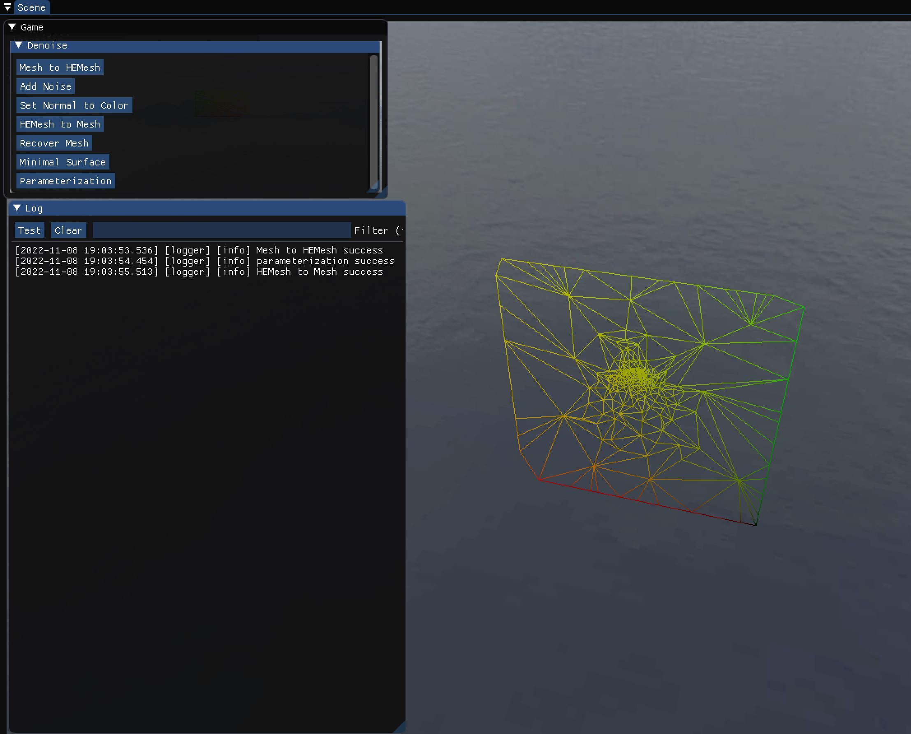
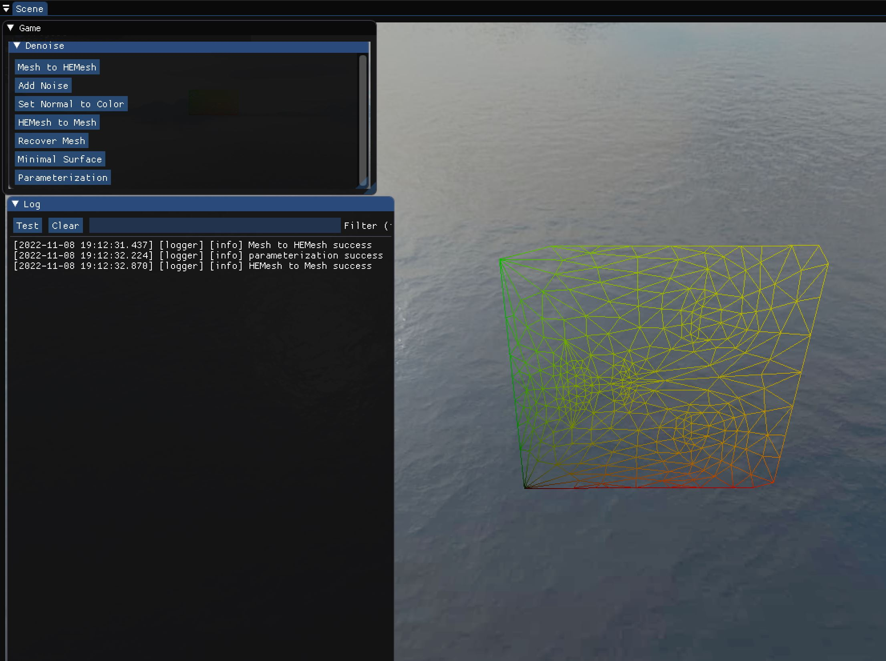

# 作业 7（极小曲面全局方法、曲面参数化）  

**输入网格**  

- 在 `Hierarchy` 中右键空白处，选择 `Create Empty Entity`  
- 在 `Inspector` 中点击 `Attach Component`，选择 `struct Ubpa::Utopia::LocalToWorld`、`struct Ubpa::Utopia::MeshFilter` 和 `struct Ubpa::Utopia::MeshRenderer`  
- 将 `Project&Folder` 中的 `assets/models/Balls` 拖入 `mesh`，`assets/materials/wireframe` 拖入 `materials`  
- 在 `Hierarchy` 中点击 `Denoise Data`，将 `assets/models/Balls` 拖入 `mesh`  
- 可将 `Balls` 替换为其它网格，如 `David328` 和 `Nefertiti_face`  

`Balls`：  

`David328`：  

`Nefertiti_face`：  

**实现极小曲面的全局方法：边界固定，求解方程组**  

- 点击 `Mesh to HEMesh`  
- 点击 `Minimal Surface`  
- 点击 `HEMesh to Mesh`  

`Balls`：  

`David328`：  

`Nefertiti_face`：  

**实现曲面参数化：边界映射到平面，求解方程组**  

- 点击 `Mesh to HEMesh`  
- 点击 `Parameterization`  
- 点击 `HEMesh to Mesh`  

`Balls`：  

`David328`：  

`Nefertiti_face`：  

