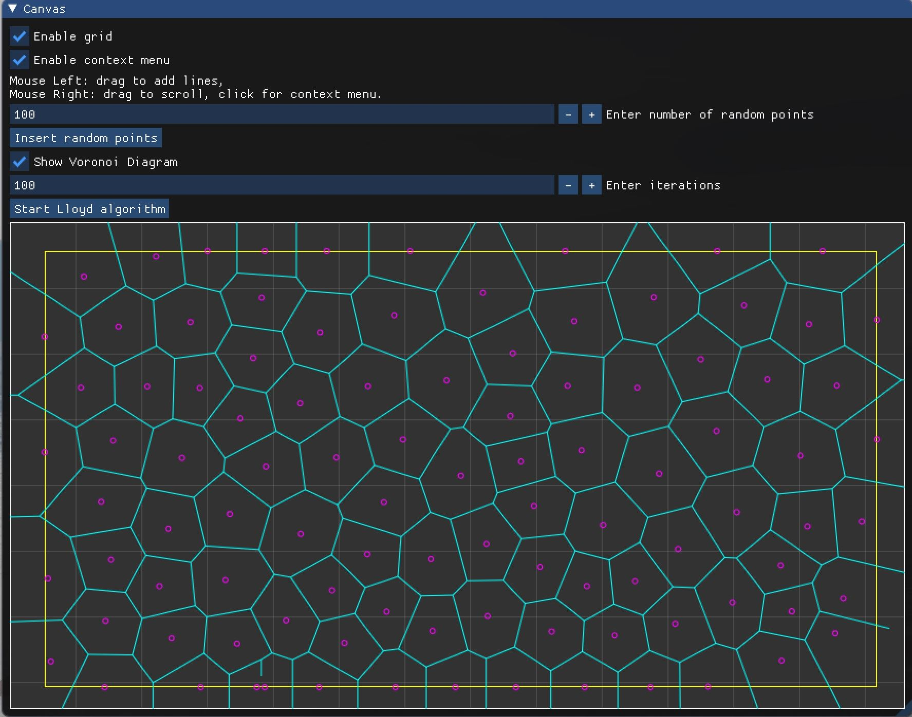

# 作业 8（平面点集 CVT 的 Lloyd 算法）  

**在给定的矩形区域内随机生成若干采样点**  

- 鼠标左键拖动绘制矩形区域  
- 输入采样点个数 100  
- 点击 `Insert random points`  

**生成这些点的 Voronoi 剖分**  

- 勾选 `Show Voronoi Diagram`  

**计算每个剖分的中心，将采样点的位置更新到重心，迭代**  

- 输入迭代次数 100  
- 点击 `Start Lloyd algorithm`  

