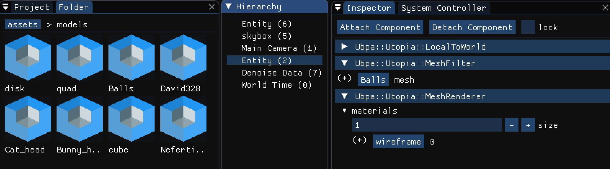
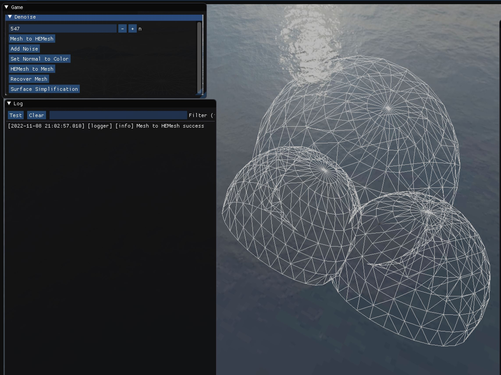
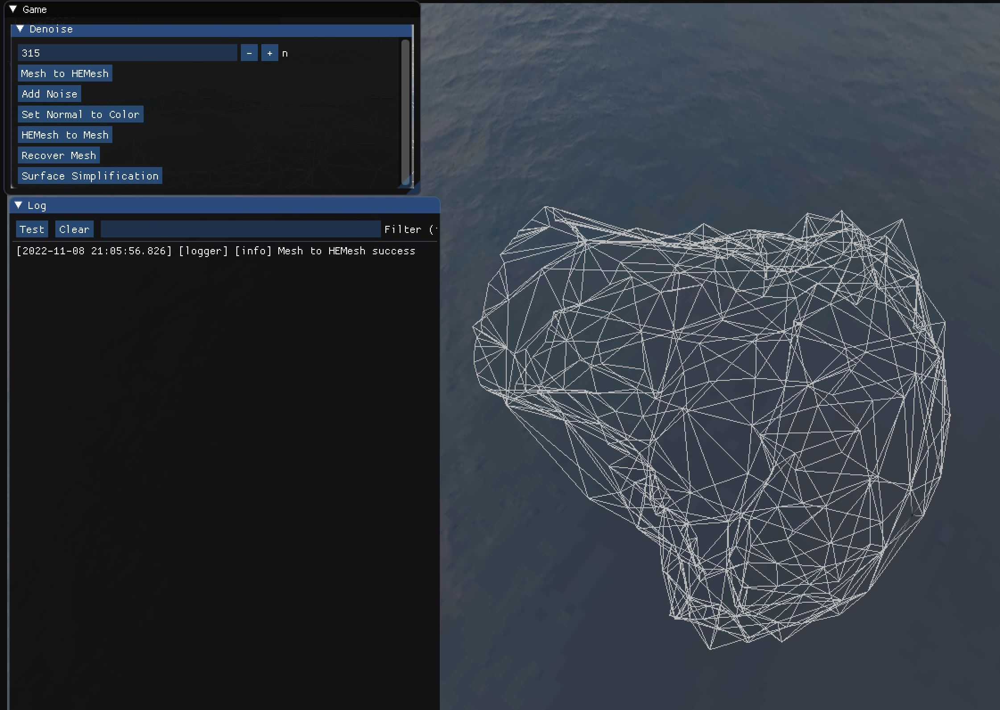
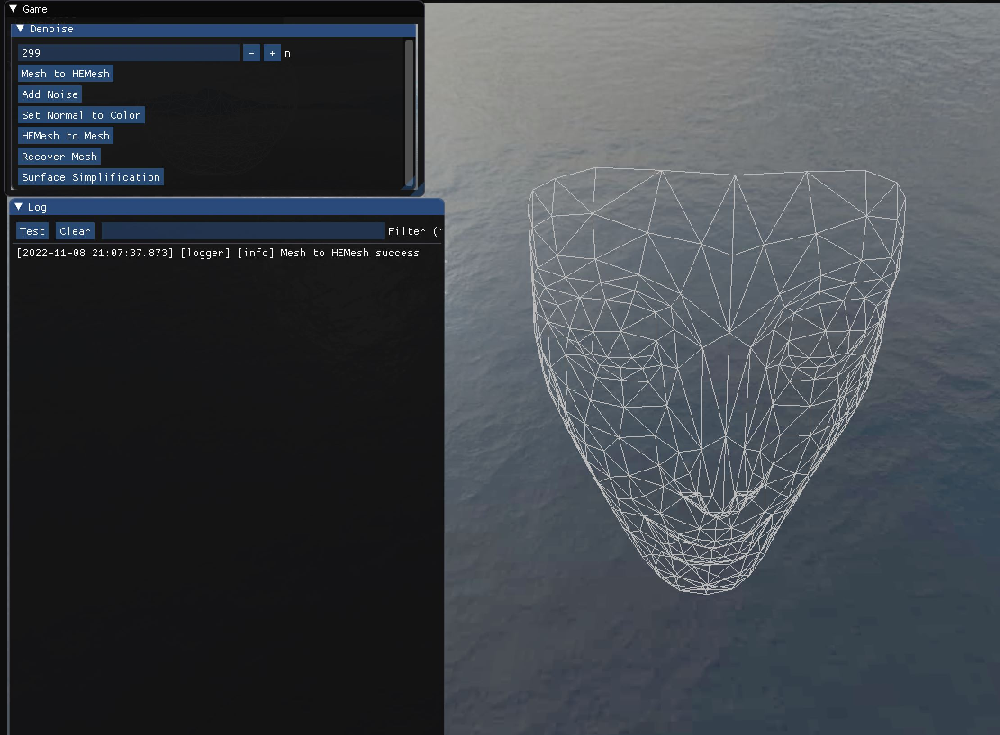
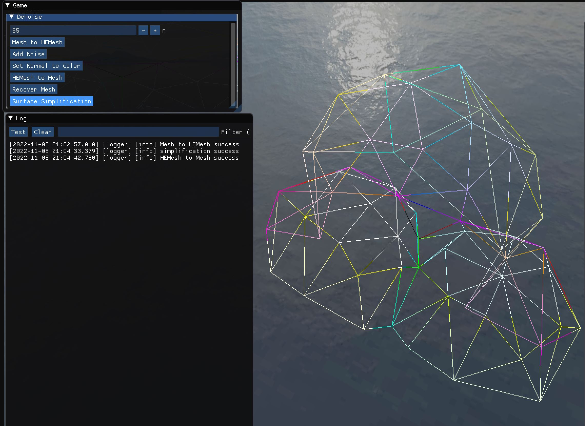
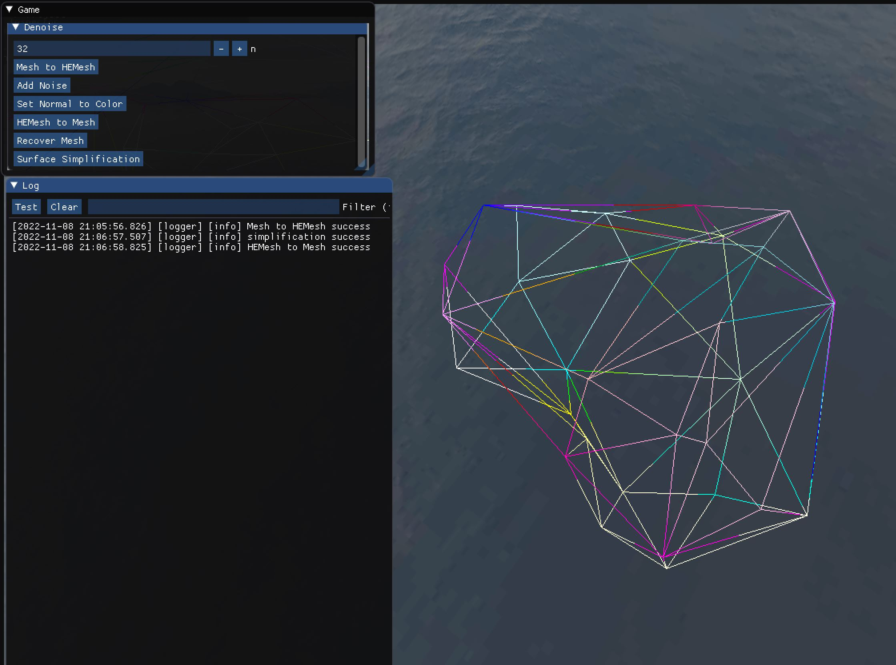
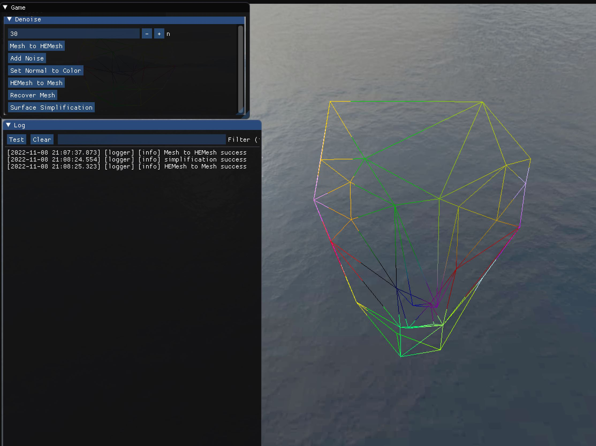

# 作业 9（网格简化的 QEM 方法）  

**输入网格**  

- 在 `Hierarchy` 中右键空白处，选择 `Create Empty Entity`  
- 在 `Inspector` 中点击 `Attach Component`，选择 `struct Ubpa::Utopia::LocalToWorld`、`struct Ubpa::Utopia::MeshFilter` 和 `struct Ubpa::Utopia::MeshRenderer`  
- 将 `Project&Folder` 中的 `assets/models/Balls` 拖入 `mesh`，`assets/materials/wireframe` 拖入 `materials`  
- 在 `Hierarchy` 中点击 `Denoise Data`，将 `assets/models/Balls` 拖入 `mesh`  
- 可将 `Balls` 替换为其它网格，如 `David328` 和 `Nefertiti_face`  

`Balls`（输入网格顶点数 $N=547$）：  

`David328`（输入网格顶点数 $N=315$）：  

`Nefertiti_face`（输入网格顶点数 $N=299$）：  

**实现网格简化的 QEM 方法**  

- 点击 `Mesh to HEMesh`  
- 输入简化网格顶点数 $n=\frac{N}{10}$  
- 点击 `Surface Simplification`  
- 点击 `HEMesh to Mesh`  

`Balls`（简化网格顶点数 $n=55$）：  

`David328`（简化网格顶点数 $n=32$）：  

`Nefertiti_face`（简化网格顶点数 $n=30$）：  

